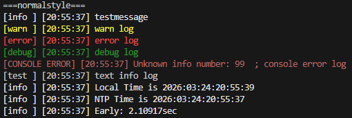
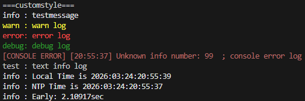

# wanlogger

A simple Python logger that can output logs while correcting the time via NTP.  
Supports console (color display) and file output.

## Usage

You can create a log with:  
```py
log(text, level)
```
If the `level` is not specified, it defaults to `info`.  

Example:  
```py
import wanlogger

logger = wanlogger.Logger()
log = logger.log

log("hello")        # [info ] [20:50:19] hello
log("warning", 1)   # [warn ] [20:50:19] warning
log("error", 2)     # [error] [20:50:19] error
```

## Log Levels
Value | Content
-|-
0 | info
1 | warn
2 | error
3 | debug

Can also be specified as a string:  
```py
logger.log("custom", "TEST")
```

## Changing the Format
Can be changed when creating the class or via `logger.formatchanger`.  

Variable | Content
-|-
%t | Time
%i | Level
%e | Message

By default, it is displayed as follows:  


Example of a custom format:  


## File Output
Off by default.

Files with the same name are automatically numbered sequentially.

Example:  
```py
logger = Logger(outputfile=True, file_path="logs")
```

## NTP Time Sync
Uses time obtained via NTP.  
Resyncs every 30 minutes by default.  
Can be turned off by setting `timesync` to False when creating the class.  

## Others
- timestyle
  - Change the format of the time shown in the log.
- offset
  - Outputs the offset between the local time and the NTP server.
  - Sync is not updated.
